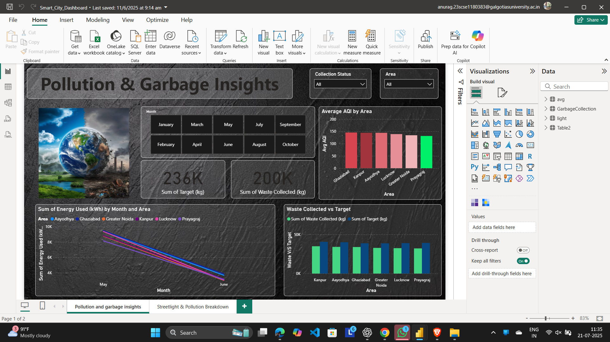
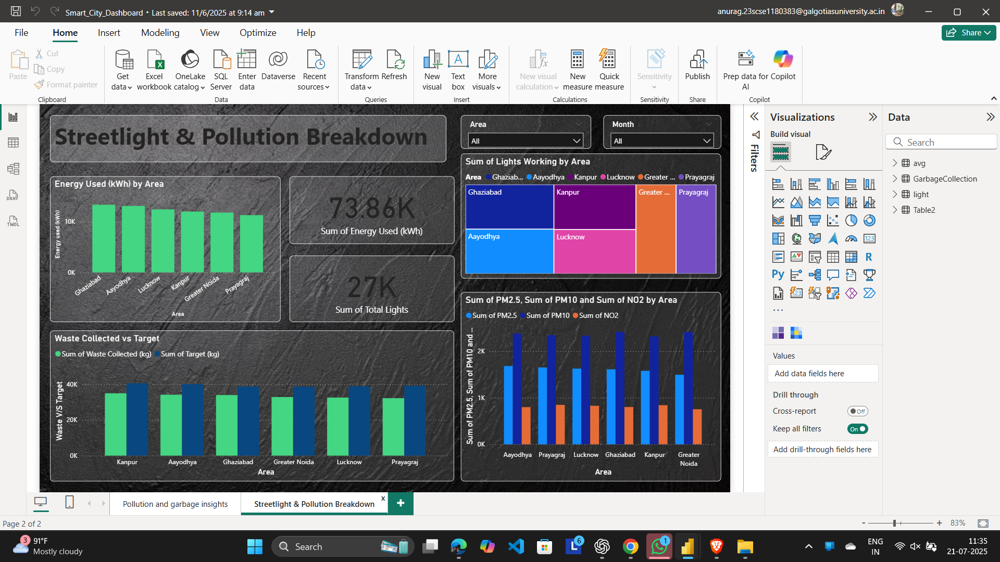

# Smart City Dashboard | Power BI Project

This Power BI dashboard provides an analytical view of key performance indicators (KPIs) related to smart city operations. It is designed for city planners, engineers, and administrators to monitor environmental conditions, infrastructure usage, and cleanliness performance across zones.

---

## 📊 Key Features:
- 🏭 **Pollution Monitoring**: Visualize AQI levels across city zones and monitor pollution trends.
- 🗑️ **Garbage Collection Analysis**: Compare actual waste collection against planned targets.
- 💡 **Streetlight Usage**: Track energy consumption by smart streetlights in various zones.
- 🗺️ **Geo Map Insights**: Interactive map-based visualization for better spatial understanding.

---

## 🛠️ Tools Used:
- Microsoft Power BI
- DAX (Data Analysis Expressions)
- Power Query (M Language)
- Excel/CSV files as data sources

---

## 🎯 Purpose:
To help government bodies and smart city stakeholders make informed decisions using real-time data on pollution, cleanliness, and electricity consumption.

---

## 📸 Screenshot:
Screenshot 1 -  

Screenshot 2 -

---

## 📂 Folder Contents:
- `Smart_City_Dashboard.pbix` – Power BI project file  
- `SCD_Image1.png` – Dashboard visual1  
- `SCD_Image2.png` – Dashboard visual2
- `README.md` – This overview document  

