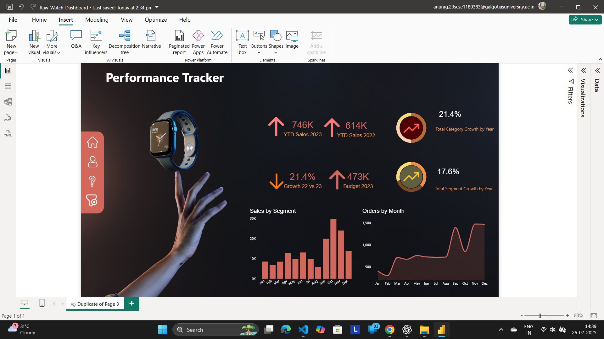

# Smartwatch Sales & Performance Dashboard

This Power BI dashboard provides key insights into the sales performance and growth metrics of a smartwatch brand. It is designed for business stakeholders to monitor overall trends, product category performance, and regional sales distribution.

## 📊 Key Features:
- 📈 **YTD Sales Comparison (2022 vs 2023)**: Track overall revenue growth year-over-year.
- 🔥 **Sales by Category**: Visual breakdown of smartwatch categories based on sales volume.
- 🌍 **Sales by Country**: Identify key regions contributing to overall revenue.
- 📆 **Monthly Order Trend**: Analyze customer order patterns and seasonal spikes.
- 🧭 **Clean UI/UX Design**: Dashboard includes custom visuals and branding elements for better stakeholder engagement.

## 🛠️ Tools Used:
- Microsoft Power BI

## 🎯 Purpose:
To assist the business and sales team in tracking smartwatch performance, identifying high-performing segments, and optimizing regional strategies based on data insights.

## 📸 Screenshot:
 <!-- Replace with actual image file name in repo -->

## 📂 Folder Contents:
- `Raw_Watch_Dashboard.pbix` – Power BI project file  
- `RWD_Image.png` – Dashboard visual  
- `README.md` – Project overview and insights
